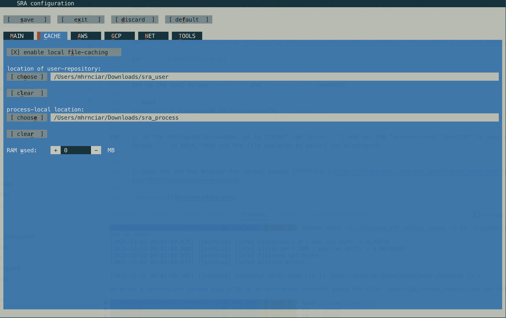
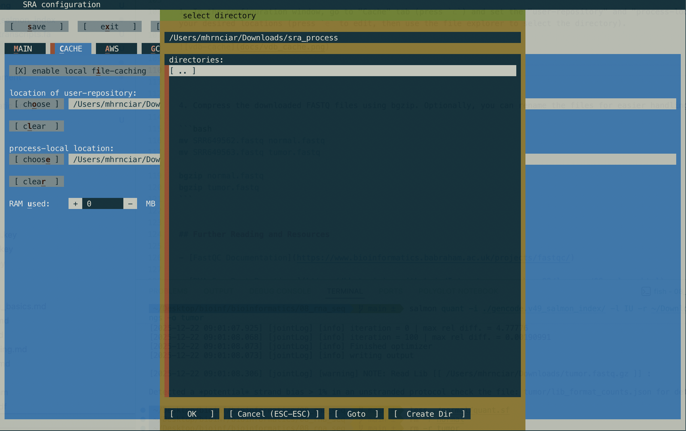

# Practicum 08: RNA-Seq

## Introduction

This practicum will focus on the analysis of RNA-Seq data, including quality control, alignment, quantification, and differential expression analysis.
You will learn how to use tools such as FastQC, STAR, Salmon, and DESeq2 to process and analyze RNA-Seq datasets.
The practicum will also cover visualization techniques for RNA-Seq data and interpretation of results.


## Objectives

By the end of this practicum, you will be able to:

1. Use the NCBI Short Read Archive (SRA) to work with publicly available sequencing datasets.

2. Perform quality control on RNA-Seq data using FastQC.

3. Quantify gene expression levels using Salmon.

4. Align RNA-Seq reads to a reference genome using STAR aligner and perform alignment-based quantification.

5. Conduct differential expression analysis using DESeq2.


## Prerequisites

- Bioinformatics resources repository cloned to your local machine. If you haven't done this yet, follow the instructions in the main README file of the repository.


## Getting Started

Additional software/tools required for this practicum:

- [STAR](https://github.com/alexdobin/STAR)

- [Salmon](https://salmon.readthedocs.io/en/latest/)

- [DESeq2](https://bioconductor.org/packages/release/bioc/html/DESeq2.html)

- [sratoolkit](https://github.com/ncbi/sra-tools)

STAR and Salmon can be installed using conda, bgzip should be available if you have samtools installed, but if not, you can install it via conda as well.

```bash
conda install -c bioconda star salmon htslib
```

DESeq2 is an R package, so you will need to install it via bioconductor or add the package using conda.

```bash
R

# Inside R console, install BiocManager
BiocManager::install(c("DESeq2", "tximport", "tximeta", "apeglm", "EnhancedVolcano"))

# Verify installation
library(DESeq2)
```

In case you want to install R using conda, you can do it as follows:

```bash
conda install -c bioconda bioconductor-deseq2 bioconductor-tximport bioconductor-tximeta

R

# Inside R console, verify installation
library(DESeq2)
```

Salmon and STAR require pre-built transcriptome index.
You can download the GTF database and transcriptome FASTA file from GENCODE and build the index using Salmon:

```bash
# Download GTF file
wget https://ftp.ebi.ac.uk/pub/databases/gencode/Gencode_human/release_49/gencode.v49.annotation.gtf.gz
gunzip gencode.v49.annotation.gtf.gz

# Download transcriptome FASTA file
wget https://ftp.ebi.ac.uk/pub/databases/gencode/Gencode_human/release_49/gencode.v49.transcripts.fa.gz
gunzip gencode.v49.transcripts.fa.gz

# Build Salmon index
salmon index -t gencode.v49.transcripts.fa -i gencode.v49_salmon_index

STAR \ 
  --runThreadN 8 \ 
  --runMode genomeGenerate \ 
  --genomeDir gencode.49_star_index \ 
  --genomeFastaFiles hg38.fa \ 
  --sjdbGTFfile gencode.v49.annotation.gtf \ 
  --sjdbOverhang 150                          # Should be read length - 1, e.g., for 151 bp reads
```

### Downloading data from SRA

Finally, we need to download the RNA-Seq dataset from the SRA archive.
The retrieval may be slow, so download the data prior to the practicum session, using the following instructions (the SRA database will be explained during the practicum).
We will be using two samples from the dataset with accession numbers [SRR36181400](https://trace.ncbi.nlm.nih.gov/Traces/index.html?view=run_browser&acc=SRR36181400&display=metadata) & [SRR36181399](https://trace.ncbi.nlm.nih.gov/Traces/index.html?view=run_browser&acc=SRR36181399&display=metadata) (knockdown) and [SRR36181395](https://trace.ncbi.nlm.nih.gov/Traces/index.html?view=run_browser&acc=SRR36181395&display=metadata) & [SRR36181394](https://trace.ncbi.nlm.nih.gov/Traces/index.html?view=run_browser&acc=SRR36181394&display=metadata) (control).


First, download the sra toolkit and unpack it:

```bash
# Ubuntu
wget --output-document sratoolkit.tar.gz https://ftp-trace.ncbi.nlm.nih.gov/sra/sdk/current/sratoolkit.current-ubuntu64.tar.gz

# Mac
curl --output sratoolkit.tar.gz https://ftp-trace.ncbi.nlm.nih.gov/sra/sdk/current/sratoolkit.current-mac64.tar.gz

tar -vxzf sratoolkit.tar.gz
```

Set up the tool to use `prefetch` and `fasterq-dump` commands:

```bash
sratoolkit.3.3.0-ubuntu64/bin/vdb-config --interactive
```

1. In the configuration window, go to "Cache" tab (press `c`) and set the "user-repository" and "process-local" paths to your desired locations (press `e` to edit, then use the file explorer to select the directory).





2. Save and exit the configuration (press `s` to save, then `x` to exit).

After setting up the configuration, you can download the RNA-Seq data using the following commands:

```bash
# Prefetch the SRA files
sratoolkit.3.3.0-ubuntu64/bin/prefetch SRR36181400 SRR36181399 SRR36181395 SRR36181394

# Convert SRA files to FASTQ format - the files will be downloaded to the user-repository path set earlier, but we don't have to specify the full path for fasterq-dump, but we can specify the output directory
sratoolkit.3.3.0-ubuntu64/bin/fasterq-dump SRR36181400 SRR36181399 SRR36181395 SRR36181394 \ 
  --split-files \ 
  --threads 8 \ 
  --outdir bioinformatics/08_rna_seq/data
```

4. Compress the downloaded FASTQ files using bgzip. Optionally, you can rename the files for easier handling:

```bash
mv SRR36181400_1.fastq knockdown_rep1_R1.fastq
mv SRR36181400_2.fastq knockdown_rep1_R2.fastq

mv SRR36181399_1.fastq knockdown_rep2_R1.fastq
mv SRR36181399_2.fastq knockdown_rep2_R2.fastq

mv SRR36181395_1.fastq control_rep1_R1.fastq
mv SRR36181395_2.fastq control_rep1_R2.fastq

mv SRR36181394_1.fastq control_rep2_R1.fastq
mv SRR36181394_2.fastq control_rep2_R2.fastq

bgzip *.fastq
```


## Further Reading and Resources

- [FastQC Documentation](https://www.bioinformatics.babraham.ac.uk/projects/fastqc/)

- [RNA-Seq Best Practices](https://hbctraining.github.io/Intro-to-rnaseq-hpc-O2/lessons/08_salmon.html)

- [DESeq2 Tutorial](https://bioconductor.org/packages/release/bioc/vignettes/DESeq2/inst/doc/DESeq2.html)

